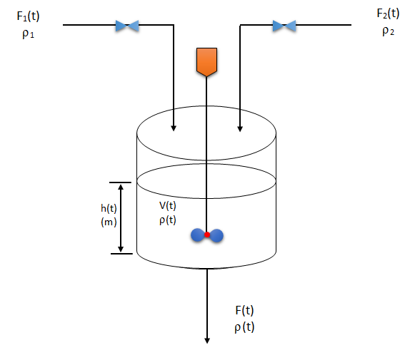

# Implementation-and-comparison-of-Advanced-process-control-to-stirred-tank-mixing-process
This is an implementation of Linear Quadratic Regulator (LQR), Minimum Principle and Model Predictive Control(MPC) to stirred tank mixing process. Please refer to [Report.pdf](Report.pdf) for the detailed information. The repository contains the MATLAB code and a detailed report explaining the implementation. This report was submitted to fulfill the course requirement of the course CHE 694: Optimal Control in the Department of Chemical and Materials Engineering, University of Alberta.



## Folder Contents :
* ```LQR``` : Contains the implimentation of Linear Quadratic Regulator(Implimentation) with lenearized system equation around a fix steady state.
* ```Nonlinear_LQR``` : Contains the implimentation of LQR with actual non-linear system equations.
* ```MINIMUM_PRINCIPLE``` : Contains the MATLAB code for implimentation of Minimum Principle with actual non-linear system equations with terminal time t_f = 8.
* ```Model Predictive Control (MPC)``` : It has two sub-folders, Approch1 - with long prediction horizon and Approch2 - with terminal constraint. 


